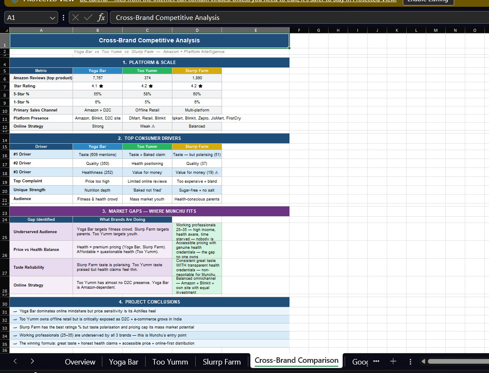

# Project 1 — Consumer Behaviour & Competitive Intelligence

This project analyses 3 D2C healthy snacking brands (Yoga Bar, Too Yumm, Slurrp Farm) using 10,000+ Amazon ratings, Google Trends (52 weeks), pricing and social media data.

## Objective
To identify consumer preferences, brand positioning, and market gaps in India's healthy snacking category.

## Key Insights
- Taste is the most important driver of purchase decisions  
- No brand strongly targets working professionals  
- Significant gap between brand messaging and consumer expectations  

## Files
- Report.pdf — full research report
-  Dashboard Preview -
 
- Dashboard.xlsx — Excel-based analysis  
- Tableau dashboard — live visualisation  

## Tools Used
Excel · Tableau · Google Trends · Amazon Review Data.
