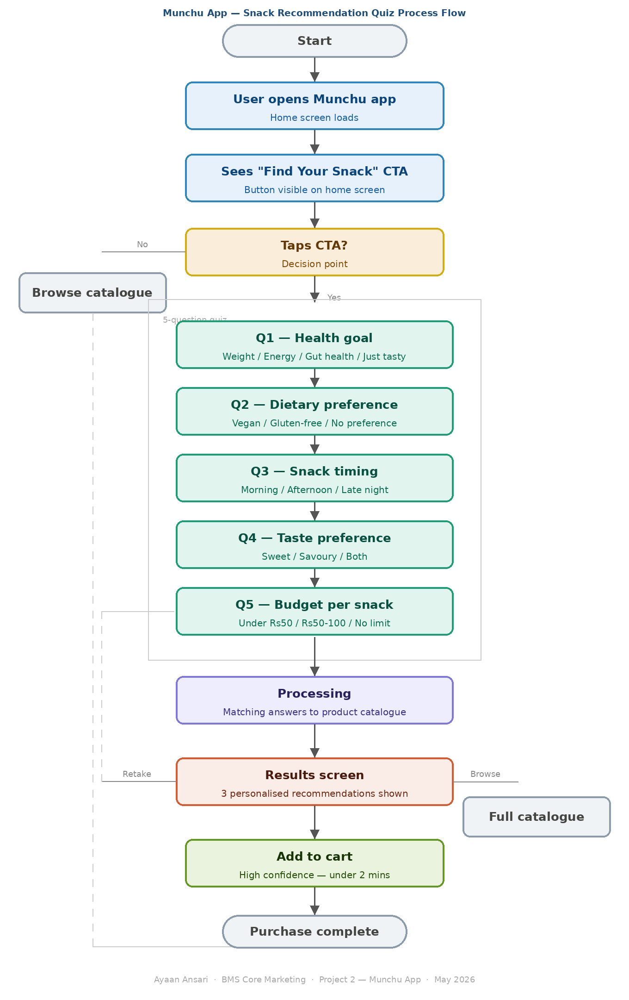

##  Projects- AYAAN ANSARI.

###  Project 1 — Consumer Behaviour & Competitive Intelligence  

Analysed 3 D2C healthy snacking brands across 10,000+ Amazon ratings, Google Trends (52 weeks), pricing and social media.  

**Tools:** Excel, Tableau  

 **Report:** [View PDF](./Project1REPORT.pdf)  
 **Excel Analysis:** [View File](./PROJECT1%20DASHBOARD.xlsx)  
 **Live Dashboard:** [View on Tableau](https://public.tableau.com/views/HealthySnackingMarketIntelligenceAyaanAnsari/HealthySnackingBrandsMarketIntelligenceDashboard)

###  Project 2 — Business Requirements Document  

BRD for Munchu app personalised snack recommendation feature. Includes user persona, journey map, 15 functional requirements, KPIs and business case study.  

**Tools:** Word, Lucidchart, Jira  

 **BRD Document:** [View PDF](./Project-2-BRD.pdf)  
 **Jira Board:** [View Sprint Board](https://aynn11.atlassian.net/jira/software/projects/SCRUM/boards/1)

###  Process Flow  

### 🗄️ Project 3 — SQL Analysis  

Coming soon — querying healthy snacking brand data using SQL.
